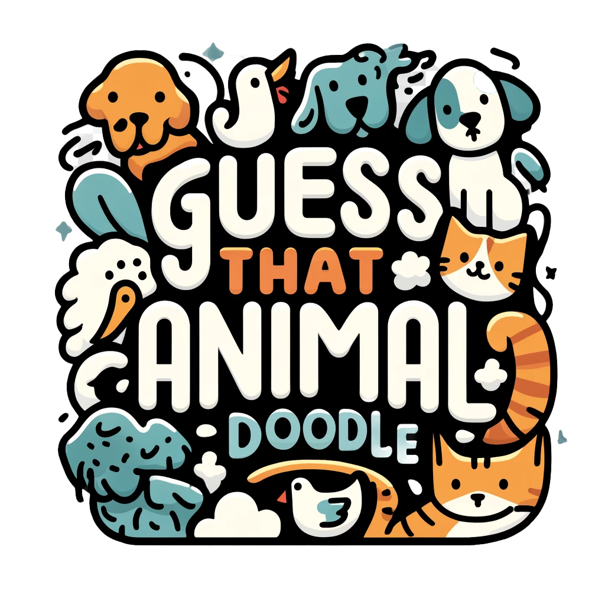

# Guess That Animal Doodle

## Description

This project is an AI application that recognizes drawings based on the [Quick, Draw!](https://quickdraw.withgoogle.com/data) dataset. The application uses a convolutional neural network (CNN) to predict the category of a doodle drawn on a **28 x 28** grid.

## Installation Instructions (MacOS)

### Prerequisites

- Python 3.x
- Pip (Python package installer)
- A virtual environment (recommended)

1. **Clone the Repository**

   ```sh
   git clone https://github.com/vukvukovich/guess-that-animal-doodle.git
   cd guess-that-animal-doodle
   ```

2. **Create a Virtual Environment and install tensorflow**

   Follow Apple guide from [here](https://developer.apple.com/metal/tensorflow-plugin/).


3. **Install the Required Packages**
 ```sh
   pip install -r requirements.txt
   ```

4. **Prepare Datasets**
   
   Download the .npy files for different animal categories from the [Google Quick, Draw! Dataset](https://console.cloud.google.com/storage/browser/quickdraw_dataset/full/numpy_bitmap;tab=objects). Place them in the `ml/datasets` directory. Make sure to rename the files and naming convention is respected e.g. new-animal.npy.

### Training the Model

1. **Train the Model**
 ```sh
   python ml/train.py
   ```

### Running the Application

1. **Start the Flask Application**
 ```sh
   python app.py
   ```

2. **Open Your Browser**

Navigate to [http://127.0.0.1:5000/](http://127.0.0.1:5000/) to access the application.

## Project Structure

```
guess-that-animal-doodle/
├── app.py
├── ml
│   ├── datasets
│   │   ├── bear.npy
│   │   ├── bird.npy
│   │   ├── cat.npy
│   │   ├── cow.npy
│   │   ├── dog.npy
│   │   ├── elephant.npy
│   │   ├── fish.npy
│   │   ├── giraffe.npy
│   │   ├── horse.npy
│   │   ├── lion.npy
│   │   ├── monkey.npy
│   │   ├── mouse.npy
│   │   ├── pig.npy
│   │   └── sheep.npy
│   ├── models
│   │   └── quickdraw_cnn_model_some_animals.keras
│   └── train.py
├── static
│   ├── css
│   │   └── style.css
│   ├── images
│   │   └── logo.webp
│   └── js
│       └── script.js
├── templates
│   └── index.html
├── requirements.txt
└── README.md

```